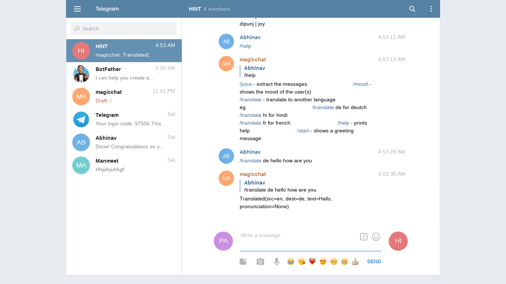
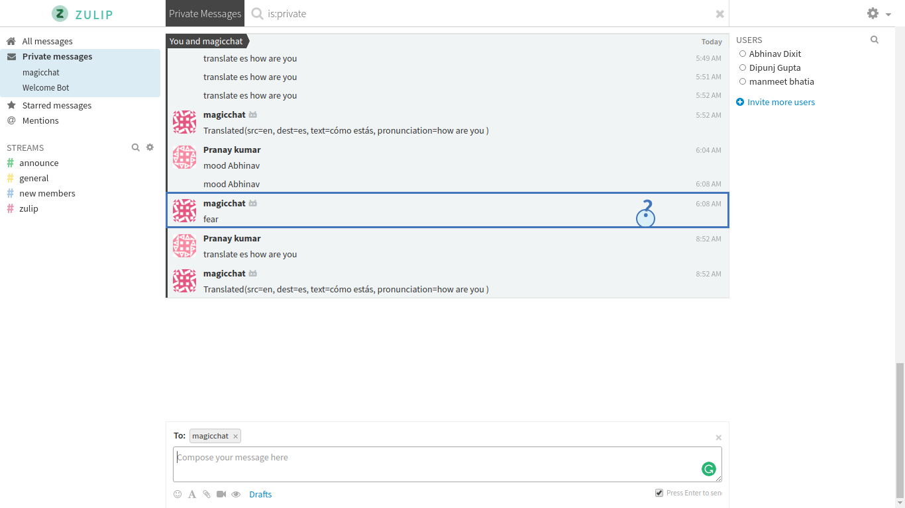

# MagicChat

Everyday **millions** of people connect using electronic forms of communication like mobile phones, emails, but most of all through texting applications like Whatsapp, Telegram and similar choices.

Texting is really effective in terms of clarity, flexibility and ability to multitask. But the major drawback of electronic texting is that we cannot electronically capture our emotions and transmit them alongside the text.
Emojis were invented but, they are rarely accurate.

So we thought to use machine learning (indico.io) to evaluate what a person A feels towards another person B when he is texting, based on the texts A sends to B.

Apart from that, a big headache in being a customer of texting apps is the GROUP CHAT. Yes, it needs to be in capital letters because, they are really big - on a large enough texting group one can easily accumulate ~250 unread messages, and miss them.

This can be a serious flaw in modern communication, given that humans like to be lazy, chances are they are going to skip those 250 texts. That one important text/ topic of discussion can be left unattended.

We thought to solve this problem using a clustering algorithm to extract out the vital information(using textRank algorithm), thus saving time and energy.
To implement such a task we thought to use Telegram's open source API as building from scratch wasn't feasibe.

## USAGE for Telegram Bot
+ juice - extract the messages(using NLP)
+ mood - shows the mood of the user(s)
+ translate - translate to another language
translate de for deutch
translate hi for hindi
translate fr for french
+ help - prints help
+ start - shows a greeting message

### Installation requirements
sudo -E pip3.6 python-telegram-bot networkx nltk sklearn scipy indicoio \ googletrans googletrans webwhatsapi

webdrivers
- geckodriver for firefox
- chromedriver for chrome

## Zulip bot

Additional to the telegram bot that we created we have also developed a zulip bot for whatsapp.
This bot can intercept the messages between chats and in groups and thus produce the desired result as the telegram bot.
In order to make this possible , we used the Whatapp API by mukulhase.We modified it according to our use.
In order to use it make sure you have all the modules mentioned in requirements.txt file.
Run the magicbot.py file and scan the QR code for webwhatsapp and hence your zulip bot is ready.
Now you can query the zulip bot in the same manner as the telegram bot.
Only limitation is that your phone needs to be connected to the internet at all times.

